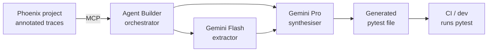

# phoenix2pytest

[](https://github.com/golikovichev/phoenix2pytest/actions/workflows/ci.yml)
[](https://github.com/golikovichev/phoenix2pytest/actions/workflows/codeql.yml)
[](https://www.bestpractices.dev/projects/13011)
[](https://codecov.io/gh/golikovichev/phoenix2pytest)
[](https://www.python.org/downloads/)
[](https://opensource.org/licenses/MIT)
[](https://github.com/golikovichev/phoenix2pytest/commits/main)

> Turn production LLM failures into regression tests. Automatically.

**Built for:** [Google Cloud Rapid Agent Hackathon, Arize track](https://rapid-agent.devpost.com/)

**Stack:** Google Cloud, Vertex AI, Gemini 2.5, Agent Builder, Arize Phoenix MCP, FastAPI, pytest

> **Status:** Alpha (v0.1.0). Built for the Devpost submission cycle ending June 2026.

---

## The problem

You ship an LLM feature. Three weeks later, a Slack thread mentions a customer got a weird response. You dig. The prompt has been edited twice since release. The model has been quietly re-quantised by the provider. Nobody added a test that would have caught it.

Existing eval frameworks ask you to predict failures up front. You write evals against your LLM, run them, get scores. That works for known failure modes you can imagine. It does not work for the failure that just got escalated to your phone.

## The idea

phoenix2pytest goes the other direction. It reads traces from your Arize Phoenix project, picks the ones flagged as failures, and synthesises pytest cases that would have caught them. Production traffic feeds your regression suite without manual translation.

| Existing tools | phoenix2pytest |
|---|---|
| Direction: spec to eval to run | Direction: trace to failure to test |
| You predict what to test | You react to what broke |
| Eval scores | Concrete pytest assertions |
| Catches what you imagined | Catches what actually happened |

## How it works

1. Your LLM application emits traces to Arize Phoenix (standard OpenInference instrumentation).
2. You annotate failed traces in the Phoenix UI (manual review, or via Phoenix evals).
3. phoenix2pytest reads annotated traces via the Phoenix MCP server.
4. A Gemini agent extracts evidence and assertion strategy per failure.
5. A second pass synthesises a runnable pytest file.
6. You drop the test into your repo and your CI catches the regression next time.

> The pipeline runs end-to-end on a single trace (`/`) or on many annotated traces in one request (`/batch`), both on the web UI and Cloud Run. Batch mode groups traces by failure mode and folds shared modes into one parametrised test.

## Architecture



The orchestrator runs on Cloud Run, fetches traces through the Arize Phoenix MCP server, calls Gemini twice per trace (Flash for evidence extraction, Pro for code generation), and writes the synthesised test file.

## Quickstart

The web UI is the primary entry point during the hackathon. A console-script CLI is on the roadmap (see below).

**Local web UI:**

```bash
git clone https://github.com/golikovichev/phoenix2pytest
cd phoenix2pytest
pip install -e ".[dev]"
```

Create a `.env` file in the repo root:

```
PHOENIX_BASE_URL=https://app.phoenix.arize.com/s/your-space
PHOENIX_API_KEY=your-phoenix-api-key
GOOGLE_CLOUD_PROJECT=your-gcp-project
GOOGLE_CLOUD_LOCATION=us-central1
GOOGLE_GENAI_USE_VERTEXAI=True
```

Application Default Credentials are picked up automatically for Vertex AI, so no API key is needed if you have run `gcloud auth application-default login`. If you prefer the direct Gemini API, set `GEMINI_API_KEY` instead of the Vertex variables.

Run the FastAPI web UI and open it in a browser:

```bash
uvicorn phoenix2pytest.web:app --reload --port 8000
# http://localhost:8000
```

**Cloud Run deploy** (see [`cloudbuild.yaml`](cloudbuild.yaml) for the full pipeline):

```bash
gcloud builds submit --config cloudbuild.yaml
```

## Demo

A 3-minute walkthrough video accompanies the Devpost submission. The demo shows a real Phoenix trace with a hallucination, phoenix2pytest extracting the failure, generating a pytest file, the run showing red, a prompt fix, and the run showing green.

## How is this different from DeepEval, Opik, pytest-evals, Langfuse?

Short answer: those tools are about running evals you wrote. phoenix2pytest is about generating tests from failures you saw. Different direction, different mental model.

| Tool | What it is | When to use |
|---|---|---|
| **DeepEval** | pytest-style framework for writing LLM evals | You know the failure modes you care about and want to define metrics |
| **Opik** | LLM observability with pytest integration | You want eval scores in CI |
| **pytest-evals** | Minimal pytest plugin for running evals at scale | You want parametrised eval runs |
| **Langfuse** | LLM tracing platform with evals | You want production tracing plus scoring |
| **phoenix2pytest** | Generates pytest tests from observed failures | You want your regression suite to keep up with production reality |

You can use phoenix2pytest alongside the others. It does not compete with eval frameworks; it feeds them. The output of phoenix2pytest is a pytest file you can run via DeepEval, Opik, pytest-evals, or plain pytest. Your choice.

## What it catches and does not catch

**Catches:**

- Hallucinations of specific facts when those facts appear as identifiable strings in the bad output
- Format breaks: JSON wrapped in markdown when pure JSON was demanded, missing fields, wrong types
- Refusals where the model should have answered
- Wrong reasoning when correct answer or clarification was reachable
- Stale-data claims when the model invented current information

**Does not catch yet:**

- Semantic-level paraphrased failures where the model fabricates the same fact in different words
- Failures that only appear in long context or multi-turn flows
- Subtle quality degradations without a clear bad-string pattern

The roadmap covers paraphrase tolerance via embedding-similarity assertions (post-hackathon).

## Limits

- Loads matched traces in memory. For projects with hundreds of thousands of failed traces you will want a streaming variant.
- Generated tests assume the same model the failure was observed against. Cross-model regression suites need explicit configuration.
- Test quality depends on Gemini synthesis quality. For unusual failure modes, manual review of the generated test is prudent.

## Honesty notes

- The synthesised pytest is a starting point, not a final test. Engineers review it before commit.
- The agent does not auto-classify random traces. It works on traces already labeled as failures (manual annotation, eval framework, or heuristic). This is intentional. Automatic failure detection on raw traces is not reliable for hallucinations of facts the classifier itself cannot verify.
- Built solo by one engineer for a hackathon submission. Production hardening is on the roadmap, not yet done.

## Roadmap

- **v0.1** (hackathon submission, June 2026): one-trace and many-trace generation, hallucination + format_break + refusal_bug + stale_data + wrong_reasoning + off_topic_drift coverage, Cloud Run hosting, web UI.
- **v0.2**: paraphrase-tolerant assertions via embedding similarity.
- **v0.3**: multi-turn trace handling.
- **v0.4**: PyPI release with `phoenix2pytest` console-script CLI and broader documentation.

## License

MIT. See [LICENSE](LICENSE).

## Acknowledgements

Built on Arize Phoenix, Google Cloud Vertex AI, OpenTelemetry, and OpenInference semantic conventions. Thanks to the maintainers of all four projects.
